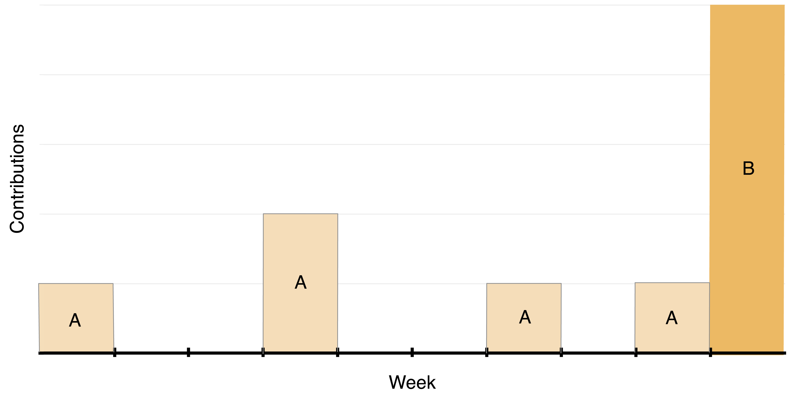
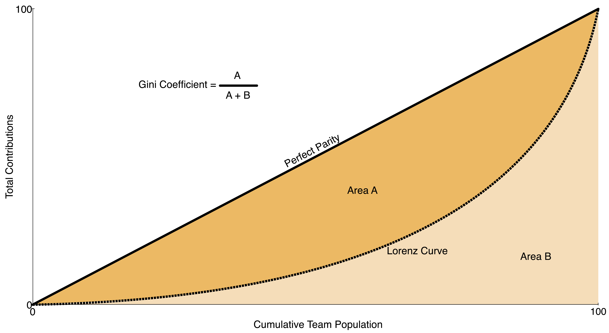
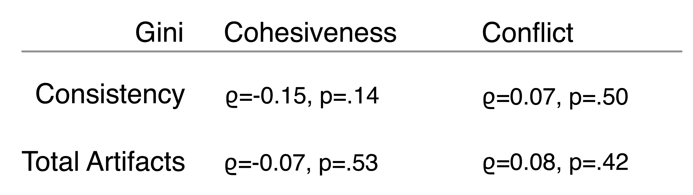
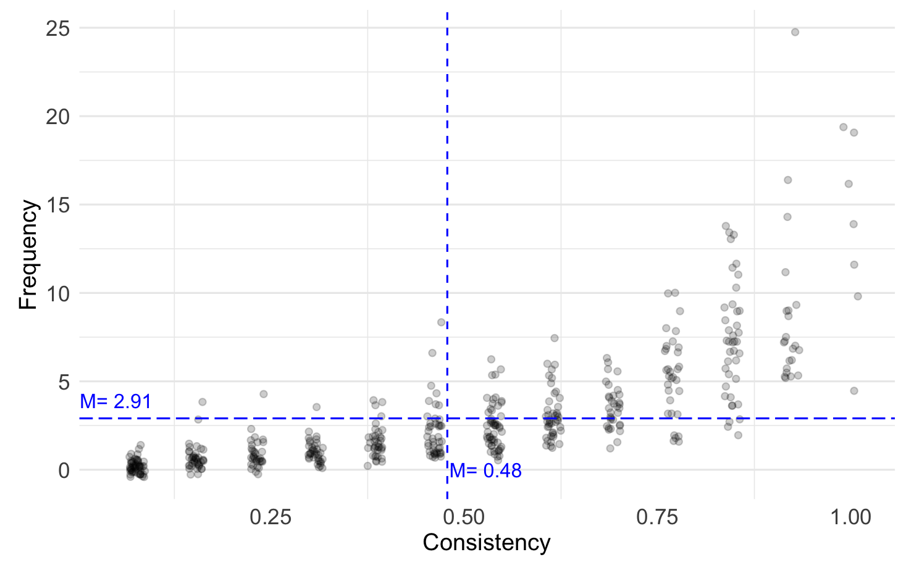

[comment]: # (Compile this presentation with the command below)
[comment]: # (mdslides index.md && mv index/index.html .)
[comment]: # (THEME = night)
[comment]: # (CODE_THEME = base16/zenburn)
[comment]: # (The list of themes is at https://revealjs.com/themes/)
[comment]: # (The list of code themes is at https://highlightjs.org/)
[comment]: # (Pass optional settings to reveal.js:)
[comment]: # (controls: true)
[comment]: # (keyboard: true)
[comment]: # (progress: true)
[comment]: # (width: "1024")
[comment]: # (markdown: { smartypants: true })
[comment]: # (hash: false)
[comment]: # (respondToHashChanges: false)
[comment]: # (Other settings are documented at https://revealjs.com/config/)

#### Chronicling Consistency and Parity of Contributions to Software Engineering Team Projects
----------

Kevin Buffardi, Rahul Bijoor, Aviral Kumar Srivastava, Tamanjeet Kaur Sidhu, Shalavritha Mamunooru, Aditi More

</img>

[LearnByFailure.com](https://learnbyfailure.com/chronicling/)

[comment]: # (!!!)

#### Software Engineering Education

- Team projects provide experiential learning

[comment]: # (||| data-auto-animate)

#### Software Engineering Education

- Team projects provide experiential learning
- Agile software development principles

[comment]: # (||| data-auto-animate)

#### Software Engineering Education

- Team projects provide experiential learning
- Agile software development principles
- <u>M</u>inimum <u>V</u>iable <u>P</u>roduct

[comment]: # (||| data-auto-animate)

#### Software Engineering Education

- Team projects provide experiential learning
- Agile software development principles
- <u>M</u>inimum <u>V</u>iable <u>P</u>roduct
- Incremental delivery-and-discovery (Scrum sprint)

[comment]: # (||| data-auto-animate)

#### Software Engineering Education

- Team projects provide experiential learning
- Agile software development principles
- <u>M</u>inimum <u>V</u>iable <u>P</u>roduct
- Incremental delivery-and-discovery (Scrum sprint)
- Contributing in a team

[comment]: # (||| data-auto-animate)

### How to fairly and accurately evaluate individuals in a team?

[comment]: # (!!!)

#### Common Approaches to Evaluating Individuals

- Team Grades
- Peer/Self Evaluations
- Data Mining for Contribution Quantity

[comment]: # (||| data-auto-animate)

#### Unintended Outcomes

**Team Grades**

[comment]: # (||| data-auto-animate)

#### Unintended Outcomes

**Team Grades**
- Social loafing, responsibility hoarding

[comment]: # (||| data-auto-animate)

#### Unintended Outcomes

**Peer/Self Evaluation**

[comment]: # (||| data-auto-animate)

#### Unintended Outcomes

**Peer/Self Evaluation**
- Collusion, personal biases

[comment]: # (||| data-auto-animate)

#### Unintended Outcomes

**Data Mining for Contribution Quantity**

[comment]: # (||| data-auto-animate)

#### Unintended Outcomes

**Data Mining for Contribution Quantity**
- Sacrificing quality for quantity
- Procrastinating

[comment]: # (||| data-auto-animate)

#### What about...

- Inactive or "lone wolf" members
  - Should contribute iteratively
  - Looking for "Signs of life"

[comment]: # (|||)

#### Investigating Contribution Consistency

[comment]: # (!!!)

#### Consistency

</img>

[comment]: # (||| data-auto-animate)

#### Consistency

Data mined team repositories (via GitHub API)
- Counted artifacts:
  - Issue creation
  - Commits
  - Pull Requests
  - Code Reviews
  - Comments

[comment]: # (||| data-auto-animate)

#### Consistency

10 semesters of upper-division Software Engineering
  - 94 teams
  - 19,095 artifacts
  - 465 unique students

[comment]: # (||| data-auto-animate)

#### Consistency

</img>

[comment]: # (||| data-auto-animate)

#### (dis?) Parity

Gini Index
- Originally a measurement of economic inequality
- Can be used to compare contributions within team
- (maximum parity) 0 to 1 (maximum disparity)

[comment]: # (||| data-auto-animate)

#### (dis?) Parity

Gini Index

</img>

[comment]: # (||| data-auto-animate)

#### Investigating Contribution Consistency

**RQ1** Is team parity of <u>total contributions</u> and/or <u>consistency of
contributions</u> associated with team cohesiveness or lack of
conflict?

[comment]: # (||| data-auto-animate)

#### Team Affect

End of semester CATME surveys
- Cohesiveness (M=3.79, sd=0.4)
- Conflict (M=1.5, sd=0.37)

[comment]: # (||| data-auto-animate)

#### Team Affect

Consistency (% weeks with 1+ contribution)
- M=0.48, sd=0.26
- Team Gini: M=0.32, sd=0.12

Total Artifacts
- M=37.78, sd=42.25
- Team Gini: M=0.51, sd=0.17

[comment]: # (||| data-auto-animate)

#### Team Affect

Spearman &rho; Correlations 

</img>

[comment]: # (|||)

#### Does consistency tell us anything?

[comment]: # (!!!)

#### Consistency

**RQ2** What unique insights may contribution consistency provide
about teamwork that are not already revealed by other metrics?

[comment]: # (||| data-auto-animate)

#### Consistency

</img>

[comment]: # (||| data-auto-animate)

#### Consistency

- 12% (n=55) students contributed only during a single week of the semester
  - *Not* only students who contributed at the very end (n=15, 27%)
- Maybe teams have different internal cultures
  - Rhythm of sharing contributions

[comment]: # (||| data-auto-animate)

#### Consistency

Investigating each team's median student:

`Regression ~ Median_Artifacts + Median_Consistency + Gini_Artifacts + Gini_Consistency`

`Cohesiveness = 3.514 + 0.575 * Median_Consistency`
`Conflict = 1.645 + 0.007 * Median_Artifacts - 0.727651 * Median_Consistency`

[comment]: # (||| data-auto-animate)

#### Going Forward

[comment]: # (!!!)

#### Chronicling Consistency and Parity of Contributions to Software Engineering Team Projects

<small>This presentation is accessible at [learnbyfailure.com/chronicling/](https://learnbyfailure.com/chronicling/) and its source is available on [GitHub](https://github.com/kbuffardi/chronicling/).</small>

</img>

<small>[Back to LearnByFailure](https://learnbyfailure.com/research/)
</small>
